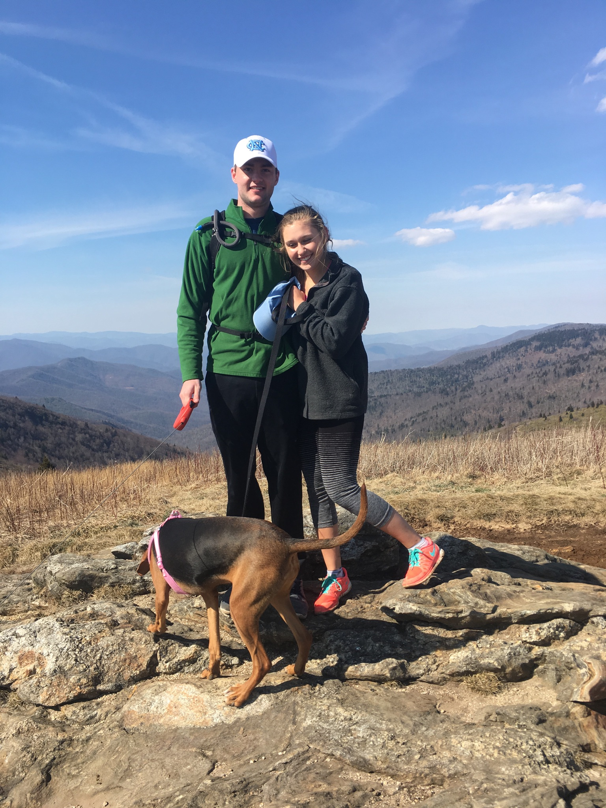
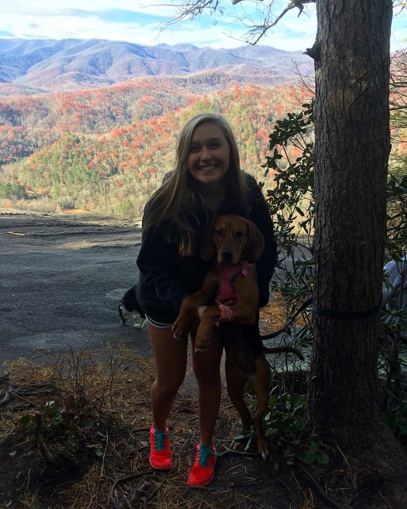
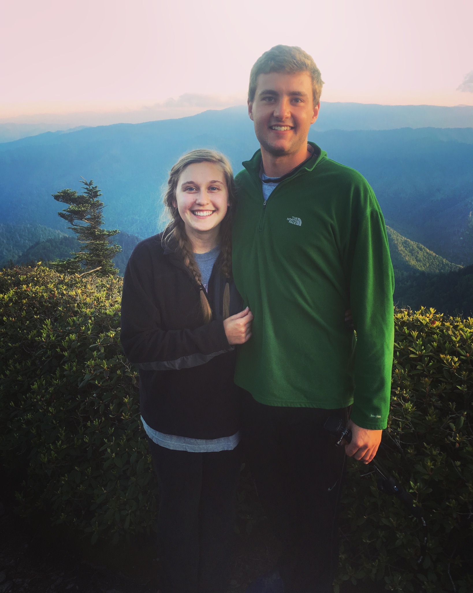
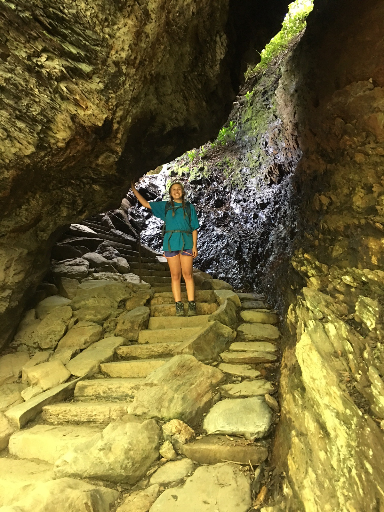
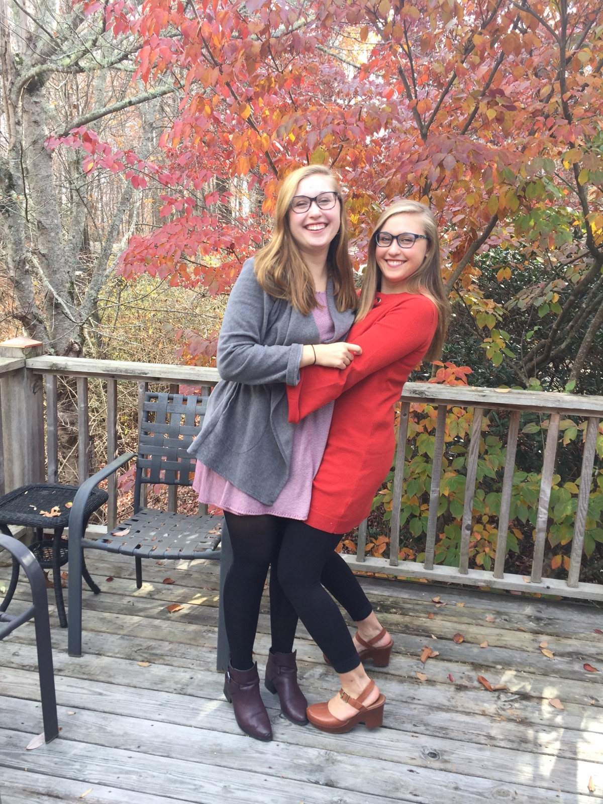

---
title: "About Me"
output:
  html_document:
    theme: flatly
--- 

Hello! I am a senior mathematics major here at App State. My hobbies include hiking, running,and hanging out with my friends, my family and my dog (a cute lil' hound girl named Quinn).

```{r, echo = FALSE}
knitr::include_graphics("./mypic.jpg")

```

My hometown is Brevard, NC, home to white squirrels and Brevard College. The beautiful views attract people from all over the country, and I have certainly taken advantage of the hiking opportunities! 

```{r, echo = FALSE}


```

This summer, I hiked Mount LeConte in Gatlinburg, TN. This was my favorite hike that I've ever done, because the views are incedible but also different from home or Boone. The hike is 5.5 miles up and 5.5 miles down, where you are displaced by an elevation of approx 3500 ft. There is a lodge up at the top with cabins (that don't have electricty or running water), and an overlook where you can see the sunset with a full 180 degree view. 

```{r, echo = FALSE}


```

My dad has been a long time runner (he has run so many marathons that I've lost count), and my mom and I recently started running this summer and have started running races. It has become a hobby that I enjoy immensely for its competitive aspects and stress relief. It has also become somewhat of a bonding experience with my parents. About a month ago, I ran my first half marathon, and plan to run another on December 9th (the blurry 3rd picture is the only one I got before my half). 

```{r, echo = FALSE}
knitr::include_graphics("./running1.jpg")
knitr::include_graphics("./running2.jpg") 
knitr::include_graphics("./running3.jpg") 
```

This is my twin sister Caitlyn and I. She is also a student here at Appalachian State, and she is majoring in social work. 

```{r, echo = FALSE}

```

The Murrays are an ~Appalachian State family~. My parents met at Appalachian State, and they both graduated from here. Mom and Dad never miss watching a football game, either in person or online. In May, there will be two more Mountaineer graduates! Here is a picture of my sister, mom, and grandma at our Family Weekend tailgate (Dad not pictured). 

```{r, echo = FALSE}

```